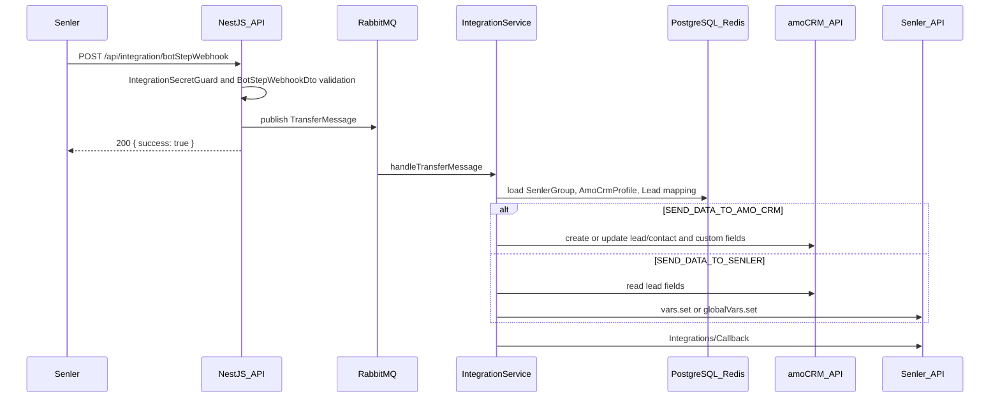

# Техническое описание интеграции Senler и amoCRM

Документ описывает реализованную backend-интеграцию Senler и amoCRM в сервисе `amo-crm`. Он предназначен для сопровождения, отладки и дальнейшего развития интеграции.

## Назначение и область работы

Сервис связывает шаги бота Senler с сущностями amoCRM. Основной сценарий: Senler отправляет webhook при выполнении шага бота, сервис принимает событие, ставит задачу в RabbitMQ и асинхронно синхронизирует данные.

Поддерживаются два направления передачи:

- `SEND_DATA_TO_AMO_CRM`: данные лида и переменные Senler записываются в сделку amoCRM, при необходимости создается контакт.
- `SEND_DATA_TO_SENLER`: данные из полей сделки amoCRM записываются в переменные Senler через `senler-sdk`.

Интеграция отвечает за:

- подключение Senler-группы к amoCRM через OAuth-коды;
- хранение связки Senler lead id, amoCRM lead id и amoCRM contact id;
- обработку webhook шага бота и callback в Senler;
- получение справочников amoCRM для UI настройки шага;
- retry, rate limit, refresh token flow и сохранение ошибок amoCRM для UI.

Интеграция не реализует UI и не управляет бизнес-логикой воронок за пределами переданных настроек шага.

## Архитектура

Основные компоненты:

- NestJS HTTP API: `src/main.ts`, `src/app.module.ts`.
- Домен интеграции: `src/domain/integration/`.
- Подключение групп Senler: `src/domain/senlerGroups/`.
- Шаблоны шагов: `src/domain/integrationStepTemplates/`.
- amoCRM client: `src/external/amo-crm/`.
- Senler client/callback: `src/external/senler/`.
- PostgreSQL через Prisma: `prisma/schema.prisma`.
- Redis: кеш Prisma, rate limit, locks, ошибки групп, delayed flags.
- RabbitMQ: очередь асинхронной обработки transfer-сообщений.
- Prometheus metrics: `src/domain/metrics/`.

Общий runtime-поток:



### Модель данных

Схема находится в `prisma/schema.prisma`.

- `AmoCrmProfile`: домен amoCRM, access/refresh tokens, лимит запросов. Один профиль может быть связан с несколькими Senler-группами.
- `SenlerGroup`: Senler group id, Senler access token, ссылка на amoCRM profile, связанные лиды и шаблоны шагов.
- `Lead`: связь `senlerLeadId` с `amoCrmLeadId` и опциональным `amoCrmContactId`; уникальность задана по `senlerLeadId` и паре `senlerLeadId + senlerGroupId`.
- `IntegrationStepTemplate`: имя и JSON-настройки шаблона шага для конкретной Senler-группы.

Удаление `SenlerGroup` каскадно удаляет связанные `Lead` и `IntegrationStepTemplate`. Удаление `AmoCrmProfile` каскадно удаляет связанные группы.

## API и payload

Глобальный prefix API: `/api`. Swagger доступен по `/api/docs`.

Основные endpoints:

- `POST /api/senlerGroups`: создание подключения группы. Payload: `senlerGroupId`, `amoCrmDomainName`, `amoCrmAuthorizationCode`, `senlerAuthorizationCode`.
- `GET /api/senlerGroups/:identifier/?field=id|senlerGroupId`: получение группы с шаблонами.
- `DELETE /api/senlerGroups/:identifier/?field=id|senlerGroupId`: удаление группы.
- `POST /api/integration/botStepWebhook`: webhook шага бота Senler. Защищен `IntegrationSecretGuard`.
- `DELETE /api/integration/change-amocrm-account`: смена amoCRM-аккаунта для Senler-группы.
- `GET /api/integration/amocrm-workspace-info?senlerGroupId=`: поля, воронки и пользователи amoCRM для настройки UI.
- `GET /api/integration/AmoCrmErrors?senlerGroupId=`: получение сохраненных ошибок amoCRM по группе.
- `DELETE /api/integration/AmoCrmErrors?senlerGroupId=`: очистка ошибок группы.
- `POST/PATCH/GET/DELETE /api/integrationStepTemplates`: CRUD шаблонов шага.
- `GET /api/metrics`: Prometheus metrics.

### Webhook Senler

DTO: `BotStepWebhookDto` в `src/domain/integration/dto/integration.dto.ts`.

Ключевые поля:

- `senlerGroupId`: id группы Senler во внутреннем контексте интеграции.
- `senlerVkGroupId`: VK group id для вызовов `senler-sdk`.
- `lead`: данные лида Senler, включая `id`, `vkUserId`, `personalVars`, `name`, `surname`, `country`, `city`, `tgUsername`, `vkDomain`, `maritalStatus`.
- `publicBotStepSettings`: настройки шага. Может прийти строкой JSON и преобразуется в `PublicBotStepSettingsDto`.
- `requestUuid`: id запроса для логов и трассировки.
- `integrationSecret`: секрет интеграции, альтернативный заголовку `x-integration-secret`.
- `integrationCallbackKey`: ключ для проверки callback в Senler.
- `botCallback`: данные callback от Senler, если callback нужен.

Пример минимальной структуры:

```json
{
  "senlerGroupId": 123,
  "senlerVkGroupId": 456,
  "lead": {
    "id": "lead-1",
    "name": "Ivan",
    "surname": "Ivanov",
    "personalVars": { "phone": "+79990000000" },
    "vkUserId": 111,
    "country": "RU",
    "city": "Moscow",
    "tgUsername": "ivan",
    "vkDomain": "id111",
    "maritalStatus": "null"
  },
  "publicBotStepSettings": {
    "type": "SEND_DATA_TO_AMO_CRM",
    "syncableVariables": [{ "from": "%phone%", "to": "123456" }],
    "amoCrmTransferringSettings": {
      "pipelineId": 1,
      "statusId": 2,
      "price": "1000",
      "name": "Lead %phone%",
      "responsibleUserId": 10,
      "createContact": true
    }
  },
  "requestUuid": "acde070d-8c4c-4f0d-9d8a-162843c10333",
  "integrationSecret": "secret",
  "integrationCallbackKey": "callback-key",
  "botCallback": null
}
```

### RabbitMQ message

После успешной валидации webhook сервис публикует `TransferMessage`:

```json
{
  "payload": { "...": "BotStepWebhookDto" },
  "metadata": {
    "retryNumber": 0,
    "createdAt": "2026-06-17T12:00:00.000Z",
    "delay": 0
  }
}
```

Сообщения публикуются в `RABBITMQ_TRANSFER_EXCHANGE` или `RABBITMQ_TRANSFER_DELAYED_EXCHANGE` с routing key `RABBITMQ_TRANSFER_ROUTING_KEY`. Consumer привязан через `@AmqpEventPattern(AppConfig.RABBITMQ_TRANSFER_QUEUE)` в `IntegrationController`.

## Маппинг данных

Маппинг переменных описан в `src/domain/integration/integration.utils.ts`.

Для направления `SEND_DATA_TO_AMO_CRM`:

- `syncableVariables[].from` берется из переменных Senler;
- `syncableVariables[].to` интерпретируется как id поля amoCRM;
- шаблон `%varName%` заменяется значением из `lead.personalVars`;
- значение поля amoCRM обрезается до 2000 Unicode code points.

Для направления `SEND_DATA_TO_SENLER`:

- `syncableVariables[].from` может содержать `%fieldId%`, где `fieldId` является id custom field amoCRM;
- `syncableVariables[].to` является именем переменной Senler;
- значения пишутся через `SenlerApiClientV2`.

Если значение не найдено, используется строка `null`.

## Ошибки, retry и безопасность

### Защита webhook

`IntegrationSecretGuard` проверяет секрет в заголовке `x-integration-secret` или в `body.integrationSecret`. Значение сравнивается с `INTEGRATION_SECRET`.

### Валидация и формат ошибок API

Глобальный `ValidationPipe` настроен в `AppService.setupValidation()`:

- `422 Unprocessable Entity` для ошибок валидации;
- `transform: true`;
- `whitelist: true`;
- `enableImplicitConversion: true`.

`HttpExceptionFilter` возвращает JSON:

```json
{
  "statusCode": 422,
  "timestamp": "2026-06-17T12:00:00.000Z",
  "path": "/api/...",
  "message": ["validation error"]
}
```

HTTP-ошибки кроме `404` логируются. Prisma `P2025` обрабатывается отдельным фильтром как `404`.

### Retry transfer-сообщений

Основная обработка находится в `IntegrationService.processTransferMessage()`.

- При временной ошибке сообщение публикуется повторно в delayed exchange.
- Delay считается от `TRANSFER_MESSAGE_BASE_RETRY_DELAY` с множителем `1.5 ** retryNumber` и jitter.
- Общий предел ожидания задается `TRANSFER_MESSAGE_MAX_RETRY_DELAY`.
- Если сообщение истекло, обработка отменяется, выполняется callback в Senler с ошибкой.
- Для amoCRM `429` дополнительно ставится Redis-флаг `transferMessages:delayed:<accessToken>` примерно на 1 секунду, чтобы отложить следующие сообщения по тому же токену.

### amoCRM errors

Классификация ошибок находится в `AmoCrmExceptionType`:

- `TOO_MANY_REQUESTS`;
- `VARIABLE_TYPE_ERROR`;
- `REFRESH_TOKEN_EXPIRED`;
- `AUTHENTICATION_FAILED`;
- `ACCOUNT_NOT_FOUND`;
- `IP_ACCESS_DENIED`;
- `ACCOUNT_BLOCKED`;
- `PAYMENT_REQUIRED`;
- `DATA_PROCESSING_FAILED`;
- `UNKNOWN_ERROR` и другие.

`VARIABLE_TYPE_ERROR` не ретраится. Большинство временных ошибок откладываются через RabbitMQ. Ошибки amoCRM, кроме `TOO_MANY_REQUESTS`, сохраняются в Redis по ключу `senlerGroups:<senlerGroupId>:errors` и доступны через `/api/integration/AmoCrmErrors`.

### OAuth и rate limit

amoCRM access token обновляется в `RefreshTokensService` через refresh token. Для refresh используется Redis lock `amoCrmProfiles:<domainName>:locks:refreshTokens`, чтобы несколько воркеров не обновляли токен одновременно.

Rate limit amoCRM контролируется `RateLimitsService` через Redis sliding window. Лимит берется из `AmoCrmProfile.rateLimit`, по умолчанию `7`, с резервом `2` запроса.

HTTP-клиент Axios имеет retry для network errors, `429` и `5xx`: 2 попытки с exponential backoff и jitter.

## Конфигурация и окружения

Конфиг читается из env в `src/infrastructure/config/config.app-config.ts` и валидируется через Joi в `src/infrastructure/config/config.validation-schema.ts`.

Основные переменные конфигурации:

- `NODE_ENV`: `local`, `development` или `production`.
- `PORT`: HTTP-порт, по умолчанию `3000`.
- `MICROSERVICE_NAME`: имя сервиса, по умолчанию `amocrm`.
- `INTEGRATION_SECRET`: секрет для webhook.
- `DATABASE_URL`: PostgreSQL connection string для Prisma.
- `CACHE_DATABASE_URL`: Redis connection string.
- `CACHE_DEFAULT_TTL`: TTL кеша по умолчанию.
- `CACHE_NULL_RESULT_TTL`: TTL для кеширования пустых результатов.
- `SENLER_GROUP_CACHE_TTL`: опциональный TTL кеша групп, fallback на `CACHE_DEFAULT_TTL`.
- `LEAD_CACHE_TTL`: опциональный TTL кеша лидов, fallback на `CACHE_DEFAULT_TTL`.
- `RABBITMQ_URL`: RabbitMQ connection string.
- `RABBITMQ_PREFETCH_COUNT`: prefetch для consumer.
- `RABBITMQ_TRANSFER_EXCHANGE`: основной direct exchange.
- `RABBITMQ_TRANSFER_DELAYED_EXCHANGE`: delayed exchange типа `x-delayed-message`.
- `RABBITMQ_TRANSFER_QUEUE`: очередь обработки transfer-сообщений.
- `RABBITMQ_TRANSFER_ROUTING_KEY`: routing key для queue binding.
- `TRANSFER_MESSAGE_BASE_RETRY_DELAY`: базовая задержка retry в миллисекундах.
- `TRANSFER_MESSAGE_MAX_RETRY_DELAY`: максимальное время жизни retry в миллисекундах.
- `AMO_CRM_CLIENT_ID`, `AMO_CRM_CLIENT_SECRET`, `AMO_CRM_REDIRECT_URI`: OAuth amoCRM.
- `SENLER_CLIENT_ID`, `SENLER_CLIENT_SECRET`, `SENLER_REDIRECT_URI`: OAuth Senler.

В репозитории нет `.env.example`, поэтому при добавлении новых env-переменных нужно синхронно обновлять `config.app-config.ts`, `config.validation-schema.ts` и эксплуатационные секреты окружений.

## Зависимости и запуск

Ключевые runtime-зависимости:

- NestJS 11;
- Prisma 6 и PostgreSQL;
- Redis;
- RabbitMQ через `amqplib`;
- Axios и `axios-retry`;
- `senler-sdk`;
- `class-validator`, `class-transformer`, `joi`;
- `prom-client`, `systeminformation`, `winston`.

Полезные команды из `package.json`:

```bash
npm run build
npm run start:dev
npm run start:prod
npm run lint
npm run test
```

Docker-образ собирается на `node:20.17.0-alpine3.20`, выполняет `npx prisma generate`, `npm run build`, открывает порт `3000` и при старте запускает `npx prisma migrate deploy && npm run start`.

## Мониторинг и отладка

Для первичной диагностики:

- проверить доступность `/api/docs` и `/api/metrics`;
- найти `requestUuid` из webhook в логах;
- проверить наличие сообщения в `RABBITMQ_TRANSFER_QUEUE`;
- проверить delayed exchange и заголовок `x-delay` при retry;
- проверить Redis-ключи `senlerGroups:<senlerGroupId>:errors`, `transferMessages:delayed:<accessToken>`, rate-limit ключи amoCRM;
- проверить актуальность `AmoCrmProfile.accessToken` и `refreshToken` в БД;
- проверить, что amoCRM домен и OAuth redirect URI соответствуют окружению;
- при `invalid_grant` выполнить повторное подключение аккаунта amoCRM через продуктовый flow.

Метрики `/api/metrics` включают:

- CPU и RAM gauges;
- `db_cache_hits_total`, `db_cache_misses_total`, `db_cache_errors_total`, `db_cache_reconnections_total`, `db_cache_hit_ratio_percent`;
- `webhooks_received_total`;
- активные Senler-группы за 1, 3, 7, 14 и 30 дней.

## Практические заметки для развития

- `POST /api/integration/botStepWebhook` отвечает `{ "success": true }` после постановки задачи в очередь, а не после фактической синхронизации.
- Swagger добавляет security requirement глобально, но фактический `IntegrationSecretGuard` стоит только на webhook endpoint.
- RabbitMQ consumer реализован кастомной инфраструктурой `@AmqpEventPattern`, а не стандартным Nest transport.
- Для delayed retry нужен RabbitMQ plugin `x-delayed-message`.
- `GET /api/integrationStepTemplates/:identifier/` в контроллере использует `@Param('id')`, хотя маршрут объявляет `:identifier`; при проблемах с получением шаблона это первое место для проверки.
- При расширении payload нужно обновлять DTO, Swagger-декораторы и обработку в `IntegrationService`, а также учитывать ручную трансформацию `publicBotStepSettings`.
- При добавлении новых ошибок amoCRM нужно обновлять `AmoCrmExceptionType`, человекочитаемые сообщения и правила retry/cancel.
